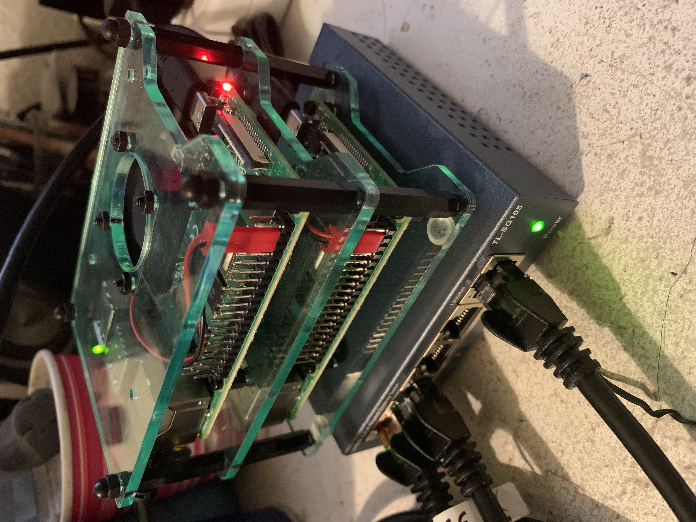
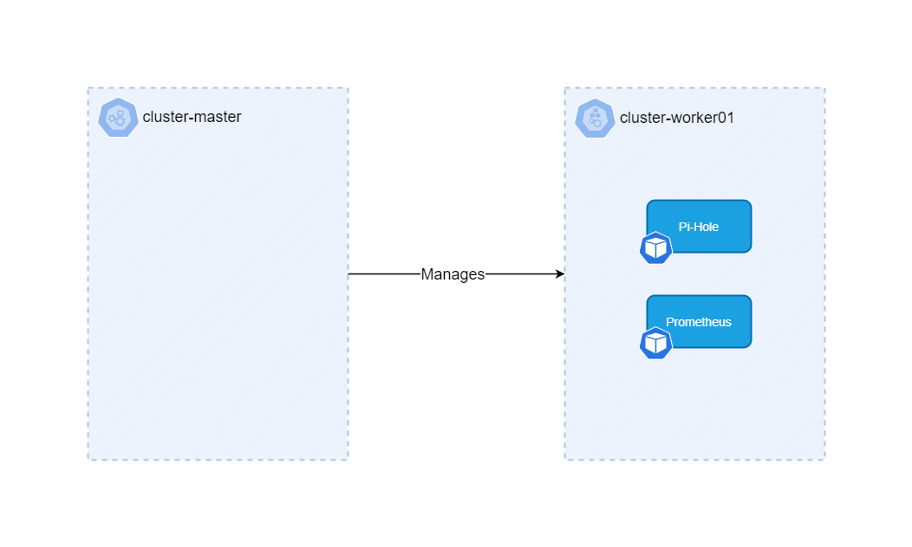

# Raspberry Pi Kubernetes Cluster

 

# Hardware

-   2x Raspberry Pi Model B 8GB RAM + 16GB Micro SD
-   2x Raspberry Pi USB-C 5V 3A Power supply
-   1x Cluster Case with fans
-   1x TL-SG105 5 Port Network Switch

# Architecture

k3s is used as the Kubernetes distrubution as it a lightweight distribution optimized for ARM, which is more suitable for Raspberry Pi's.

The cluster consists of 2 nodes.

-   Master node (cluster-master)
    -   Acts as the control plane of the Kubernetes cluster. Manages the worker nodes and the Pods in the cluster
-   Worker node (cluster-worker01)
    -   Worker node runs the workloads. Runs Pods with the containerized applications

## Diagram (WIP)

# Deployments

## Pi-Hole

## Prometheus + Grafana
