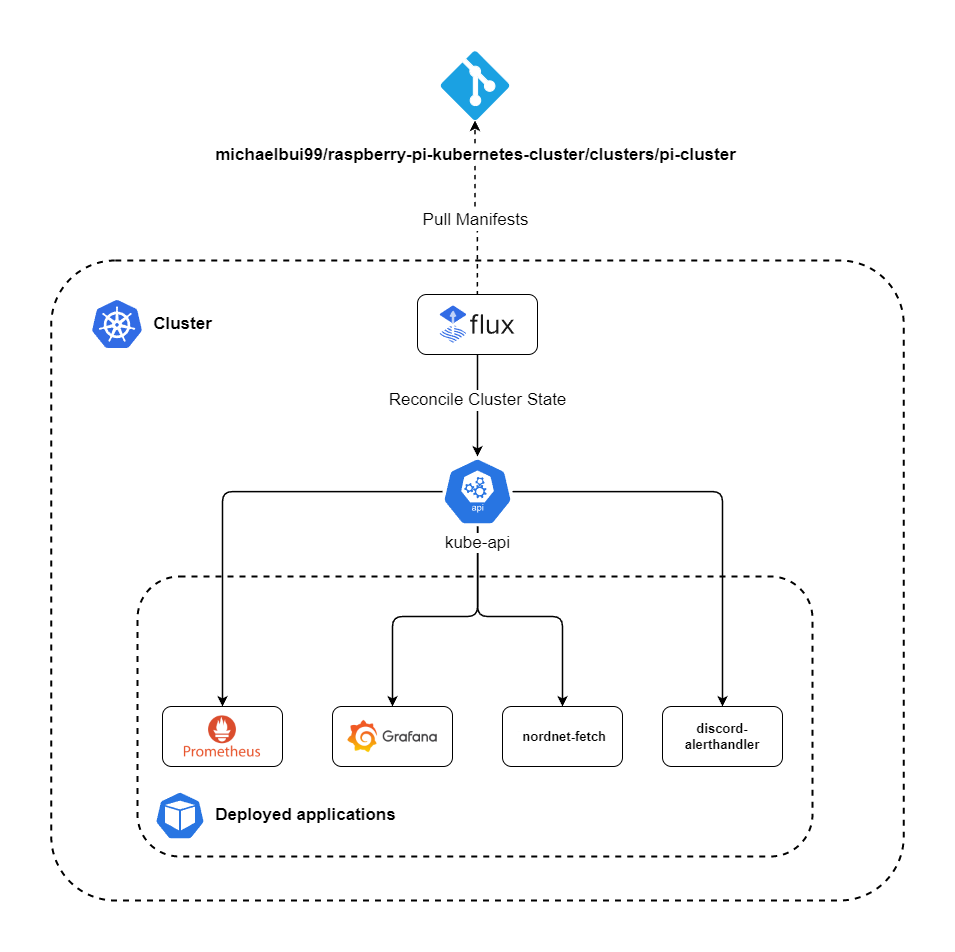

# Raspberry Pi Kubernetes Cluster

 

# Hardware

-   2x Raspberry Pi Model B 8GB RAM + 16GB Micro SD
-   2x Raspberry Pi USB-C 5V 3A Power supply
-   1x Cluster Case with fans
-   1x TL-SG105 5 Port Network Switch

# Architecture

k3s has been chosen as the Kubernetes distrubution since it a lightweight distribution optimized for ARM, which is more suitable for Raspberry Pi's.

The cluster consists of 2 nodes.

-   Master node (cluster-master)
    -   Acts as the control plane of the Kubernetes cluster. Manages the worker nodes and the Pods in the cluster
-   Worker node (cluster-worker01)
    -   Worker node that runs the workloads. Runs Pods with the containerized applications

## Diagram (WIP)

# Deployments

## Pi-Hole

Network service that will act as DNS server in my local network. Pi-Hole provides capabilities such as network-wide blocking of ads, telemetry and malware by rerouting network traffic

## Prometheus + Grafana

Open-source monitoring and alerting solution that will be used for monitoring of the cluster's overall health by using metrics such as RAM and CPU usage from each node.
