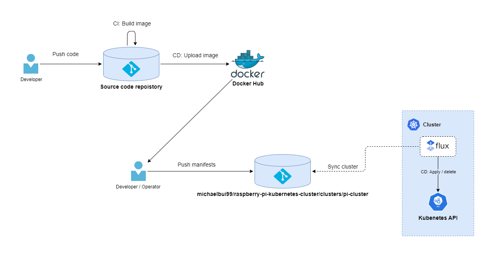

# Raspberry Pi Kubernetes Cluster

<br>


# Table of Contents

-   [Raspberry Pi Kubernetes Cluster](#raspberry-pi-kubernetes-cluster)
-   [Hardware](#hardware)
-   [Architecture](#architecture)
    -   [Overview (WIP)](#overview--wip-)
-   [Cluster](#cluster)
    -   [Deployment flow (WIP)](#deployment-flow--wip-)
    -   [Deployments](#deployments)
        -   [Flux (CD)](#flux--cd-)
        -   [Prometheus + Grafana](#prometheus---grafana)
        -   [nordnet-fetch](#nordnet-fetch)
        -   [Pi-Hole](#pi-hole)
    -   [Setup](#setup)
        -   [Headless Raspberry Pi Setup](#headless-raspberry-pi-setup)
        -   [Tailscale](#tailscale)
        -   [Add local PC ssh keys as authorized keys in cluster nodes](#add-local-pc-ssh-keys-as-authorized-keys-in-cluster-nodes)
        -   [k3s setup](#k3s-setup)
        -   [Setup kubectl access to cluster from local PC](#setup-kubectl-access-to-cluster-from-local-pc)
        -   [Bootstrap Flux and use it to deploy all other resources into the cluster.](#bootstrap-flux-and-use-it-to-deploy-all-other-resources-into-the-cluster)

# Hardware

-   2x Raspberry Pi Model B 8GB RAM + 16GB Micro SD
-   2x Raspberry Pi USB-C 5V 3A Power supply
-   1x Cluster Case with fans
-   1x TL-SG105 5 Port Network Switch

# Architecture

The cluster consists of 2 nodes.

-   Master node (cluster-master)
    -   Acts as the control plane of the Kubernetes cluster. Manages the worker nodes and the Pods in the cluster
-   Worker node (cluster-worker01)
    -   Worker node that runs the workloads. Runs Pods with the containerized applications

k3s has been chosen as the Kubernetes distrubution since it a lightweight distribution optimized for ARM, which is more suitable for Raspberry Pi's.

## Overview (WIP)


# Cluster

## Deployment flow (WIP)



## Deployments

### Flux (CD)

A open-source set of continuous delivery solutions for Kubernetes that will be used to handle the deployments to the cluster. Flux will listen for changes to a deployment git repository and then sync the state between the repository, containing the manifests describing the cluster state, and the cluster. Flux supports a pull model, which is ideal for this cluster, since it runs on a private network and is not directly exposed to the internet.

To deploy to the cluster, push a new manifest to <PROJECT_ROOT>/clusters/pi-cluster.

### Prometheus + Grafana

Prometheus is open-source monitoring and alerting solution that will be used for monitoring of the cluster's overall health by using metrics such as RAM and CPU usage from each node. <br>
Grafana is a open-source interactive data-visualization platform that will be used to visualize the metrics from Prometheus in form of various dashboards.<br>
Dashboard that visualizes general node health metrics for cluster-master and cluster-worker01: <br>


### nordnet-fetch

My python script for fetching Nordnet account data such as transactions and performance graph data, and store the data in GCP BigQuery. The script will be deployed in the cluster as a CronJob that runs daily.

### discord-alerthandler

Simple Discord alerter I wrote in go. It is registered as as a webhook receiver in the Prometheus AlertManager. When Prometheus fires a new alert, the alerter generates a Discord embed with the alert and sends it to my Discord monitoring channel

## Setup

### Headless Raspberry Pi Setup

-   Install <a href="https://www.raspberrypi.com/software/">Raspberry Pi Imager</a>
-   Connect SD card to PC
-   Open Raspberry Pi Imager
-   Choose OS and select Raspberry Pi OS Lite (64-bit)
-   Choose Storage and select the SD card
-   Configure hostname + ssh + locale settings
-   Write to SD
-   Insert SD card into Raspberry Pi
-   ssh into each Raspberry Pi and update:

    ```cli
    $ sudo apt update

    $ sudo apt upgrade
    ```

-   Add aliases to ~/.bashrc:
    ```cli
    ....
    alias ll="ls -alF"
    alias k="kubectl"
    alias ssh-master="ssh cluster-master@CLUSER_MASTER_NODE_IP"
    alias ssh-worker01="ssh cluster-worker01@CLUSER_WORKER_NODE_1_IP"
    ```

### Tailscale

Tailscale is used as VPN to allow remote access to my local network, without having to port-forward and expose cluster directly to internet. Also provides a static IP to each device connected that can be used, which makes things easier, since the Raspberry Pi's are not guranteed the same IP address on each boot due to DHCP.

-   ssh into each node in the cluster and download tailscale:
    ```cli
    $ curl -fsSL https://tailscale.com/install.sh | sh
    ```
-   Start tailscale:
    ```cli
    $ sudo tailscale up
    ```
-   Authenticate by clicking the link printed in stdout and enter credentials
-   Repeat step for every device you have that should be able to connect to the cluster

### Add local PC ssh keys as authorized keys in cluster nodes

-   Generate ssh keys from local PC:

    ```cli
    $ ssh-keygen -b 4096 -N "" -f ~/.ssh/id_rsa
    ```

-   Add keys as authorized key for each cluster node:

    ```cli
    $ ssh-copy-id CLUSTER_NODE_USER@CLUSTER_NODE_IP
    ```

-   Enter ssh password

### k3s setup

-   MASTER NODE

    -   ssh into master node and run:

        ```cli
        $ curl -sfL https://get.k3s.io | sh -
        ```

    -   Get IP address of master node and save somewhere. It is needed to connect from worker nodes:

        ```cli
        $ hostname -I
        ```

    -   Copy k3s node token. It is needed to connect from worker nodes:
        ```cli
        $ cat /var/lib/rancher/k3s/server/node-token
        ```

-   WORKER NODES

    -   ssh into worker node(s) and run:

        ```cli
        $ curl -sfL https://get.k3s.io | K3S_URL=https://YOUR_MASTER_NODE_IP:6443 K3S_TOKEN=MASTER_NODE_TOKEN sh -
        ```

-   ssh into master node and confirm that the worker node has joined the k3s cluster:
    ```cli
    $ kubectl get nodes
    ```

### Setup kubectl access to cluster from local PC

-   Copy master node kubeconfig to local PC:

    ```cli
    $ scp -r CLUSTER_MASTER_NODE_USER@CLUSTER_MASTER_NODE_IP:/home/CLUSER_MASTER_NODE_USER/.kube .

    $ mv ./.kube ~/.kube
    ```

-   Try accessing the k3s cluster:

    ```cli
    $ kubectl get pods -A
    ```

-   If you get something like: "The connection to the server ... was refused, try the following.
-   View contents of kubeconfig:
    ```cli
    $ cat ~/.kube/config
    ```
-   Check the cluster server ip. If the server points to localhost (127.0.0.1), then change it to the IP address that has been assigned in Tailscale with vim or any other text editor

    ```cli
    $ vim ~/.kube/config
    ```

-   Try accessing the k3s cluster again.

### Bootstrap Flux and use it to deploy all other resources into the cluster.

-   A simple ansible playbook has been written to bootstrap flux into the k3s cluster. The playbook is configured to my specific repository, but can be made more generic in the future.

-   Generate PAT from Github

-   Run the playbook from <PROJECT_ROOT>/ansible:

    ```cli
    $ ansible-playbook --user CLUSTER_MASTER_NODE_USER -i ./inventory/hosts.ini ./playbooks/bootstrap-flux.yaml -e "GITHUB_TOKEN=YOUR_PAT"
    ```

-   Check that the flux components has been deployed to the cluster. You should be able to see helm-controller, kustomize-controller, notification-controller and source-controller:

    ```
    $ kubectl get deployments -n=flux-system
    ```

-   From now on the git repository should be the single source of truth for the cluster. Every resource should be deployed through the git repository using manifests.
